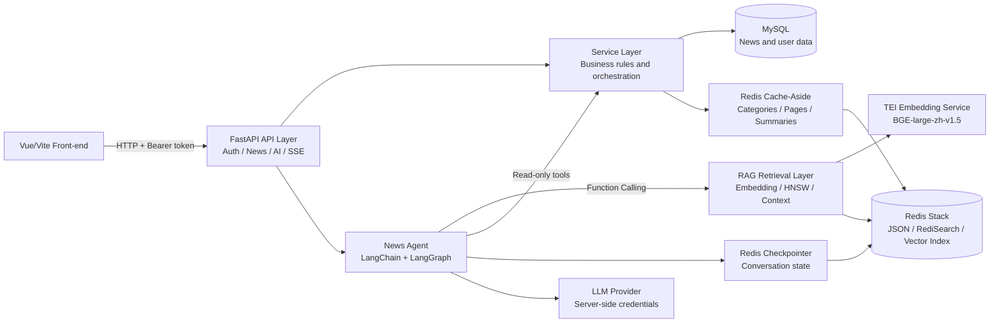
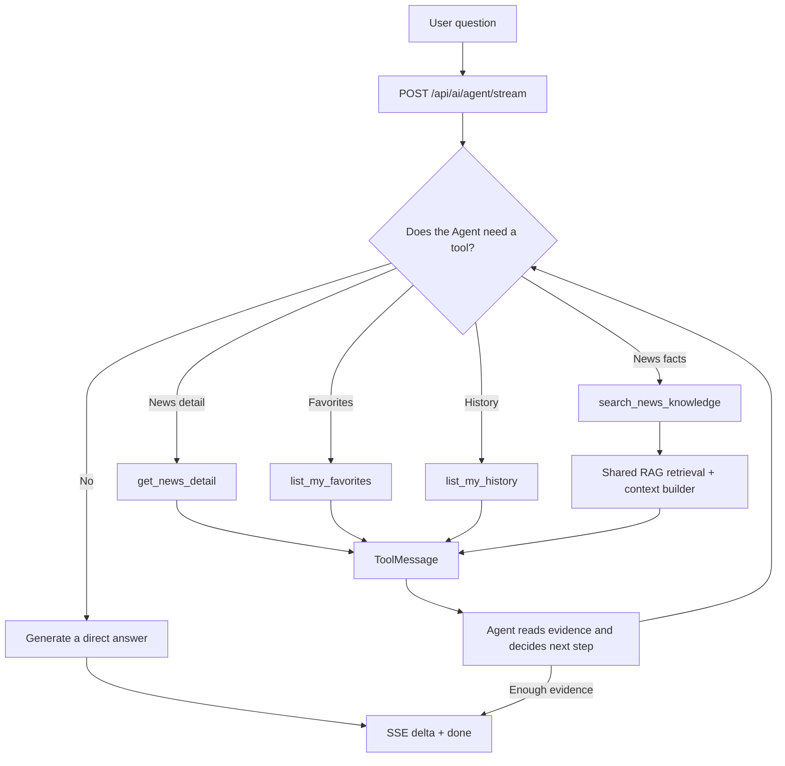
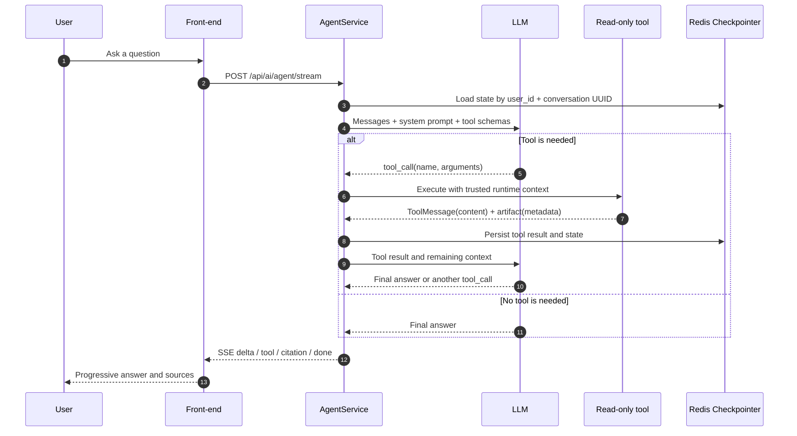
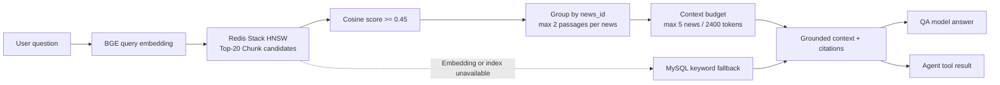
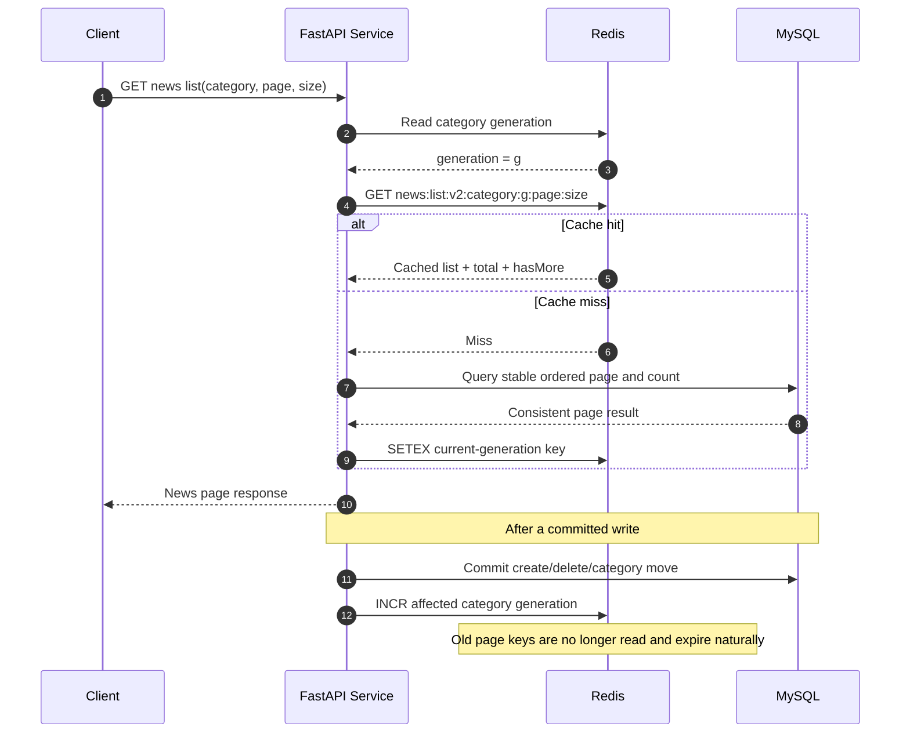

# FastAPI AI Agent News Backend

一个将新闻业务后端与 AI Agent 结合的完整应用项目：用户可以查询新闻、收藏和浏览历史，也可以通过 AI 新闻助手检索新闻知识、查询个人数据并获得带引用的流式回答。

项目的核心不是单独接入一个大模型，而是把后端业务数据、RAG 检索、Agent 工具调用、会话记忆、安全策略、缓存一致性和 SSE 交互组织成一套可运行的系统。

## Why this project

传统后端负责可靠地读取和保护业务数据，AI Agent 负责理解自然语言并选择合适的业务工具，RAG 负责为新闻事实提供可追溯证据，Redis 负责缓存热点数据、保存会话状态并支持向量检索。

| Layer | Responsibility | Main implementation |
| --- | --- | --- |
| Business backend | Authentication, news, favorites, browsing history | FastAPI, SQLAlchemy AsyncSession, MySQL, Pydantic |
| AI orchestration | Intent understanding, tool selection, multi-turn execution | LangChain `create_agent`, LangGraph |
| News knowledge | Chunking, embedding, vector search, grounded context | TEI, BGE-large-zh-v1.5, Redis Stack HNSW |
| State and performance | Cache-Aside reads, versioned invalidation, conversation checkpoints | Redis, Redis Checkpointer |
| Client interaction | Token streaming, tool progress, citations and cancellation | POST SSE, Vue/Vite |

### Overall architecture



### Main request paths

The front-end AI chat uses the Agent endpoint as its main entry point. QA also has a dedicated endpoint for a deterministic, retrieval-first flow and evaluation. Both paths share the same retrieval and context-building layer rather than maintaining two RAG implementations.



The key design decision is that RAG is an Agent capability, not a separate conversational identity. When the Agent calls `search_news_knowledge`, it performs Embedding, Redis vector retrieval, score filtering, Chunk aggregation and context construction; the Agent then uses the returned evidence to generate the final answer.

## Requirements

- Python 3.14+
- Docker Desktop with Docker Compose
- `uv`

## Configuration

Copy the environment template and set the MySQL password:

```powershell
Copy-Item .env.example .env
```

Edit `.env`:

```env
MYSQL_PASSWORD=your_mysql_password
MYSQL_DATABASE=news_app
```

The application reads MySQL, Redis, and AI settings from `app/core/config.py`. Do not commit `.env`.
`MYSQL_DATABASE` must match the database created by Docker and the SQL import. The supplied schema creates `news_app`; do not point the application at a separate test database unless that database has also been initialized with the schema.

### AI news summary

AI summary credentials are server-side settings. Add the following values only to the root `.env`; never expose `LLM_API_KEY` in `Front-end/.env` or browser code.

```env
LLM_BASE_URL=https://api.openai.com/v1
LLM_API_KEY=your-server-only-ai-api-key
LLM_MODEL=your-summary-model
LLM_TIMEOUT_SECONDS=30
AI_SUMMARY_MAX_CHARACTERS=400
AI_SUMMARY_CACHE_TTL_SECONDS=2592000
```

After logging in, request a summary for an article with:

```http
POST /api/ai/news/{news_id}/summary
Authorization: Bearer <application-token>
```

The response data contains `newsId`, `summary`, and `cacheStatus`. `miss` means the backend generated and cached a new summary; `hit` means Redis returned a summary for the current news content; `unavailable` means the model returned a summary but Redis could not be used. Cache keys include a hash of the title and body, so edited news never reuses an old summary.

### News Agent and tool-calling loop

The Agent is a ReAct-style Function Calling workflow built with LangChain `create_agent` and LangGraph. The model decides whether it needs a read-only tool, observes the `ToolMessage`, and either calls another tool or produces the final answer. The available tools are:

- `search_news_knowledge`: semantic news retrieval and RAG context construction
- `get_news_detail`: read one news article by ID
- `list_my_favorites`: read the authenticated user's favorites
- `list_my_history`: read the authenticated user's browsing history

The server derives a LangGraph `thread_id` from the trusted `user_id` and the client conversation UUID. The client never supplies a user ID to the model. Redis Checkpointer persists the conversation state, while LangChain middleware provides token-based summarization, tool-result context editing, model-call limits and PII handling.



Sensitive behavior is deliberately separated from the model-facing content: the model receives bounded evidence in `ToolMessage.content`, while structured citation and tool-status metadata is kept in `ToolMessage.artifact` for the application layer. Reasoning content, raw tool arguments, credentials and connection strings are never sent to the browser.

### AI news question answering (RAG)

Ask questions grounded in the news database through the backend:

```http
POST /api/ai/qa
Authorization: Bearer <application-token>
Content-Type: application/json

{ "question": "有哪些关于 AI 的新闻？" }
```

The response `data` contains `answer` and `citations`. Each citation includes `newsId`, `title`, and an `excerpt` taken from the actual matching Chunk. Long Chinese news is split at paragraph, sentence, and clause boundaries with the local BGE tokenizer (320-token target, 48-token overlap, 480-token hard Embedding input limit). Redis Stack returns up to 20 Chunk candidates with cosine similarity of at least 0.45; the backend groups them into at most five news articles and keeps at most two passages per article. QA and Agent share a 2400-token, overlap-aware context builder. The backend falls back to a MySQL keyword search only when the local Embedding service or vector index is unavailable.



For long Chinese news, the index stores traceable Chunk metadata: `news_id`, `chunk_id`, order, source offsets, content hash and citation fields. This lets the model see the actual matching passage instead of always receiving the beginning of the article.

All model provider credentials stay server-side. The browser only sends the application bearer token and the question; it never stores or sends an LLM API key. The frontend AI chat page calls the backend Agent endpoint rather than a provider endpoint directly.

### Streaming AI responses (SSE)

The backend also provides authenticated POST Server-Sent Event endpoints for progressive AI output:

| Endpoint | Request body | Use case |
| --- | --- | --- |
| `POST /api/ai/qa/stream` | `{ "question": "..." }` | Grounded news QA for a future QA page or another client |
| `POST /api/ai/agent/stream` | `{ "message": "...", "conversationId": "optional UUID" }` | The existing AI chat page |

Both endpoints require the application bearer token and return `Content-Type: text/event-stream`. They emit JSON payloads in these SSE event types:

| Event | Meaning |
| --- | --- |
| `meta` | Request metadata, including Agent conversation and initial memory state when applicable |
| `delta` | A user-visible answer text increment |
| `citation` | A grounded news citation (`newsId`, title, excerpt) |
| `tool` | Agent-only safe tool status (name, status, summary) |
| `done` | Exactly one successful completion event with final citations, tool summaries, conversation and memory metadata |
| `error` | A safe error after the stream has started; it is never followed by `done` |
| `ping` | Connection keepalive with no answer content |

Use browser `fetch`, not native `EventSource`, because the existing authentication model sends an `Authorization` header with a POST request. The client implementation is in [`front-end/src/api/ai.js`](front-end/src/api/ai.js); it incrementally decodes UTF-8 and supports `AbortController`:

```js
const controller = new AbortController()
await streamNewsAgent('我最近看了什么新闻？', conversationId, token, {
  signal: controller.signal,
  onEvent: ({ event, data }) => {
    if (event === 'delta') answer += data.text
    if (event === 'done') conversationId = data.conversationId
  },
})
// controller.abort() stops generation. A cancelled request is not a successful answer.
```

For a manual local verification, log in through the frontend, open **AI新闻助手**, submit a question and confirm text appears progressively. Ask a tool-oriented question such as “我最近都看了什么新闻” to observe a safe tool status. Click **停止生成** before completion and confirm that the partial response is marked stopped rather than completed. Then verify a missing token returns HTTP 401, and temporarily configure an unavailable LLM endpoint to verify an SSE `error` without `done`.

If the API runs behind Nginx or another reverse proxy, disable response buffering for these paths; otherwise token events can be held until the request completes. The backend sends `X-Accel-Buffering: no`, but the proxy still needs an equivalent setting, for example:

```nginx
location /api/ai/ {
    proxy_pass http://127.0.0.1:8000;
    proxy_buffering off;
    proxy_cache off;
}
```

SSE intentionally does not implement automatic reconnects, event IDs, replay, or rollback of already-persisted Agent checkpoint state. It never emits model reasoning, tool arguments, raw tool output, credentials, or connection strings.

## Start MySQL, Redis Stack, and Embedding

```powershell
docker compose up -d
```

This starts:

- MySQL on `localhost:3306`
- Redis Stack (Redis + RediSearch) on `localhost:6379`
- Local Text Embeddings Inference (TEI) on `localhost:8081`

Before starting TEI, put the locally downloaded `bge-large-zh-v1.5` model in `app/embedding/bge-large-zh-v1.5`. This directory is intentionally ignored by Git, so each developer must prepare it locally and must not commit model binaries.

Check that all services are healthy before starting the API:

```powershell
docker compose ps
docker exec toutiao-redis redis-cli FT._LIST
Invoke-WebRequest http://127.0.0.1:8081/health
```

If port `6379` or `8081` is occupied, set `REDIS_PORT` or `EMBEDDING_PORT` before `docker compose up -d`, and make the matching change in the backend `.env`. The application must connect to Redis Stack rather than a standard Redis server, because vector retrieval and the Agent checkpointer require RediSearch.

### Build the semantic news index

After MySQL, Redis Stack, and TEI are healthy, build the vectors explicitly:

```powershell
uv run python -m app.ai.rag.reindex
```

The command reads every current `news` row, creates token-bounded Chunks, embeds them in batches, and writes an isolated v2 build. It validates the build before atomically moving `idx:ai:news:chunk:active`; a failed build leaves the previous Alias target available. The CLI reports the `build_id`, concrete index, scanned news, generated Chunks, and written Chunks. News caches, summaries, Agent checkpoints, the previous v2 build, and the v1 index are not cleared.

Inspect and monitor the active build:

```powershell
docker exec toutiao-redis redis-cli FT.INFO idx:ai:news:chunk:active
docker exec toutiao-redis redis-cli FT._LIST
docker exec toutiao-redis redis-cli --scan --pattern 'ai:news:chunk:v2:*' | Measure-Object
```

If a newly activated build is unhealthy, point the Alias at the exact previous compatible v2 index printed by an earlier successful build:

```powershell
docker exec toutiao-redis redis-cli FT.ALIASUPDATE idx:ai:news:chunk:active idx:ai:news:chunk:v2:<previous-build-id>
```

After the rollback window, remove only an explicitly verified inactive build. `DD` deletes documents belonging to that exact concrete index; never use a broad `ai:*` key pattern:

```powershell
docker exec toutiao-redis redis-cli FT.DROPINDEX idx:ai:news:chunk:v2:<inactive-build-id> DD
```

Run the labeled retrieval parameter grid against the local TEI service:

```powershell
uv run python -m app.ai.rag.evaluate --output openspec/changes/improve-news-vector-chunking/evaluation-results.json
```

The fixture covers a fact after token 512, a boundary fact, multiple passages from one article, similar articles, and an unrelated question. The report includes `Recall@20`, `MRR`, `HitRate@5`, context precision, and citation correctness for each Chunk-size/overlap/threshold combination.

The default TEI image is pinned to `cpu-1.9`, with batches capped at four documents. If TEI is unhealthy, first confirm the model directory and `docker compose logs embedding`; the backend will continue to answer through keyword retrieval until the semantic dependency is restored. To roll back semantic retrieval temporarily, stop the `embedding` service or point `EMBEDDING_BASE_URL` at an unavailable endpoint; no API contract changes are needed because the keyword fallback remains active.

## Build the database tables

The complete schema and seed data are in [`database/database.sql`](database/database.sql). It creates the `news_app` database and these tables:

- `user` and `user_token`
- `news_category` and `news`
- `related_news`
- `favorite`
- `history`
- `ai_chat`

After MySQL is healthy, import the SQL file into the container:

```powershell
docker cp database/database.sql toutiao-mysql:/tmp/database.sql
docker exec -i toutiao-mysql sh -c 'mysql -uroot -p"$MYSQL_ROOT_PASSWORD" < /tmp/database.sql'
```

The SQL file includes initial categories, news, and a test user. Run the import once for a fresh database. Re-running it may attempt to insert the seed data again. MySQL users and passwords are initialized only when the `mysql_data` Docker volume is first created. If a new password or `MYSQL_ROOT_HOST` is configured after that first startup, preserve the data and alter the account manually, or—only for disposable local data—recreate the stack with `docker compose down -v` followed by `docker compose up -d`.

## Start the API

```powershell
uv sync
uv run uvicorn app.main:app --reload
```

The API is available at `http://127.0.0.1:8000`. Interactive API documentation is available at `/docs`.

## Project structure

```text
app/
  main.py              FastAPI application entry point
  api/routers/         HTTP route handlers
  core/                Settings, database, Redis, auth, responses, exceptions
  models/              SQLAlchemy ORM models
  schemas/             Pydantic request and response models
  services/            Current news, user, favorite, and history logic
  cache/               Redis cache key and serialization helpers
  ai/
    summarization/     Cached, server-side AI news summary generation
    embeddings/        Embedding and semantic retrieval
    rag/               Retrieval-augmented generation
    agent/             Agent orchestration and tool calling
    streaming/          SSE and other streaming responses
database/              MySQL schema and seed data
Front-end/             Vue/Vite client application
tests/                 Configuration tests
```

## Cache behavior

News categories, lists, summaries and Agent state use different cache/state
strategies because their consistency requirements are different:

| Cached data | Key strategy | Invalidation strategy | Purpose |
| --- | --- | --- | --- |
| Categories | Generation + pagination parameters | Increment category generation | Avoid stale category pages |
| News lists | Category generation + page + page size | Increment affected category generation after commit | Avoid stale pages after insert/delete/reorder |
| AI summaries | News ID + title/body content hash | New content creates a new key | Never reuse a summary for edited content |
| Agent state | LangGraph Checkpointer thread ID | TTL / explicit thread deletion | Persist multi-turn context, not public read cache |

News categories and lists use a versioned Cache-Aside flow. News lists have a
stable `publish_time DESC, id DESC` order. Each cached page contains `list`,
`total`, and `hasMore` from the same database read, so a cache hit never mixes
an old list with a newly calculated count.

1. Read the current Redis generation for the category.
2. Build a key from category, generation, page, and page size.
3. Return the cached JSON response when available; on a miss, query MySQL and
   cache the full response.
4. After a committed news create/delete/category move/order-affecting update,
   increment the affected category generation. Old page keys are no longer
   read and expire naturally.

Normal page TTL is 30 minutes with bounded random jitter. Empty pages use a
shorter TTL to reduce repeated database reads without making an empty result
durable. List-page `views` values are intentionally eventually consistent:
reading a news detail increments MySQL but does not invalidate every page in a
category.

Redis is treated as an optimization. If Redis is unavailable, the API falls
back to MySQL for cache reads and writes. Application news/category write paths
must invalidate the relevant generation *after* the database transaction has
committed. Direct SQL and imports cannot be detected automatically; after them,
run the controlled maintenance command with the affected categories:

```powershell
uv run python -m app.cache.news_cache_maintenance --category-id 2 --include-categories
```

Repeat `--category-id` for every affected category. The command touches only
the `news:*` cache-generation keys; it does not rebuild news vectors, remove
AI summaries, or clear Agent checkpoints. Rebuild vectors separately after
news content changes with `uv run python -m app.ai.rag.reindex` until the
incremental vector-index synchronization Change is implemented.



Redis is an optimization, not the source of truth. If Redis is unavailable,
news reads fall back to MySQL and cache writes are skipped. Direct SQL imports
cannot be observed automatically; use the controlled maintenance command above
after importing or changing data outside the application.

## Front-end

```powershell
cd Front-end
npm install
npm run dev
```

The browser client runs on the Vite development server, normally `http://localhost:5173`.

The AI news-summary button in the news-detail page calls the backend endpoint and sends only the application's bearer token. Its model-provider credential remains in the root backend `.env`.

